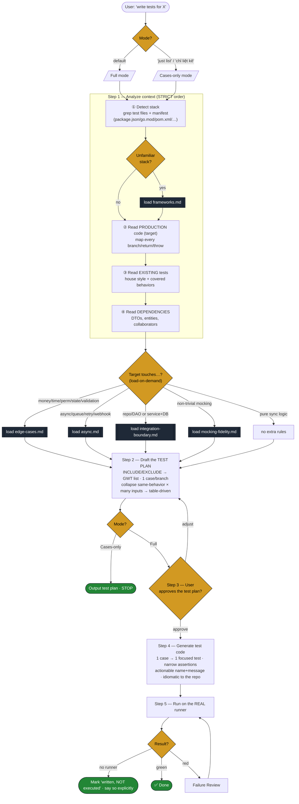
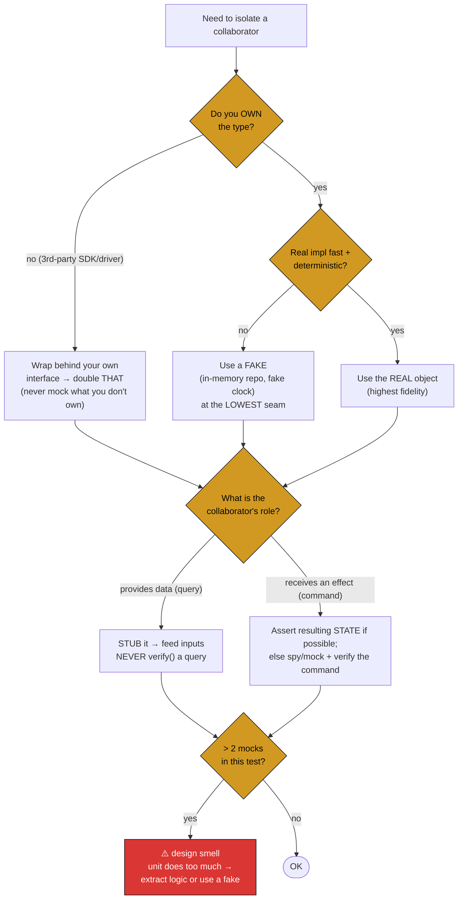
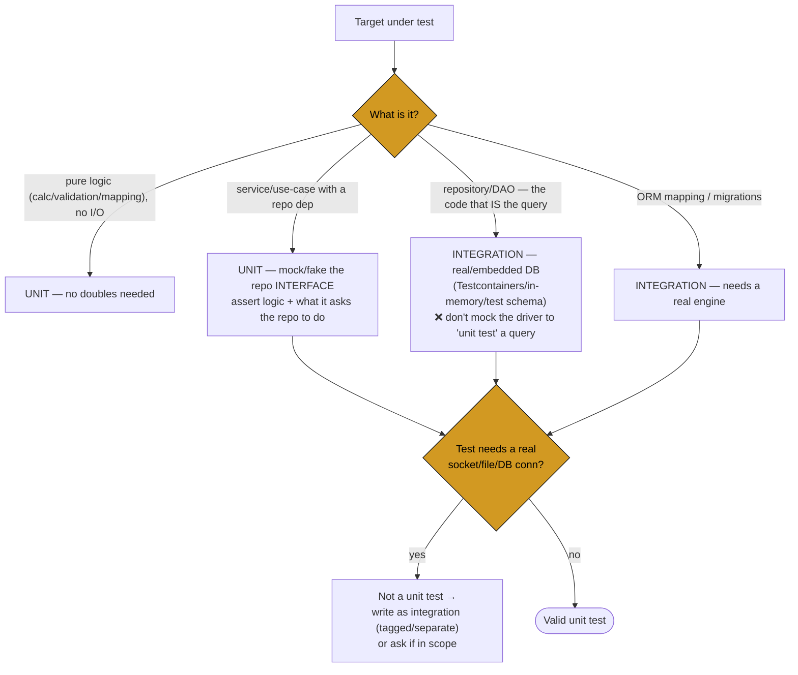
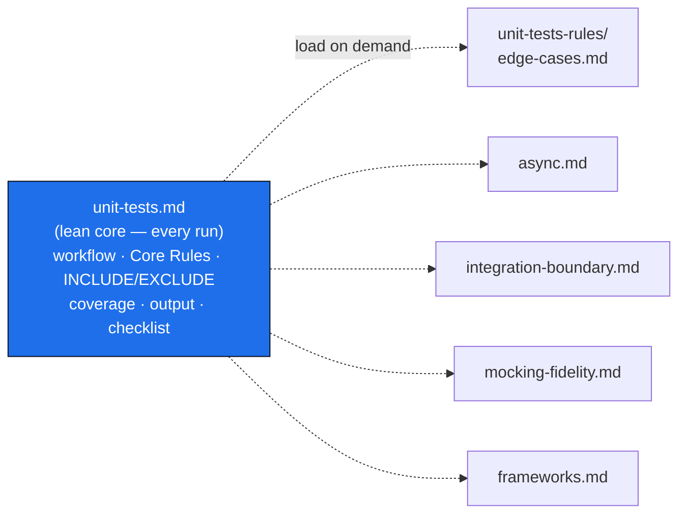

# /unit-tests — Technical Flow (for engineers)

> Execution flow of the [`/unit-tests`](../commands/unit-tests/unit-tests.md) command, including on-demand rule loading, the review gate, and the verify→triage loop.
> Non-tech version: [`unit-tests-flow.md`](./unit-tests-flow.md).

---

## 1. Full pipeline



---

## 2. Failure Review — triage a red test (never loosen blindly)

```mermaid
flowchart TD
    RED[🔴 Test fails] --> WHY{Why is it red?}
    WHY -->|production output wrong| BUG["🐞 REAL BUG<br/>report exact branch/input<br/>fix CODE — do NOT rewrite<br/>the test to match buggy output"]
    WHY -->|test asserted wrong thing| EXP["Wrong expectation<br/>fix the assertion to real<br/>expected behavior"]
    WHY -->|asserts impl detail<br/>(call order/private state/query verify)| CPL["Over-coupled<br/>loosen toward behavior<br/>(see mocking-fidelity)"]
    WHY -->|reveals uncovered path| MIS["Missing branch<br/>add the case"]

    BUG & EXP & CPL & MIS --> RETRY[Re-run]
    RETRY --> OK{Green?}
    OK -->|no| WHY
    OK -->|yes| DONE([✅])

    classDef bad fill:#da3633,stroke:#0b0f19,color:#fff;
    classDef gate fill:#d29922,stroke:#0b0f19,color:#000;
    class RED bad;
    class WHY,OK gate;
```

> Report the verdict per failure: `test X fails on <branch/input> → real bug | wrong expectation | over-coupled | missing branch`. Loosening a test to force green = silencing the alarm.

---

## 3. Mocking decision — which double, how much



Test-double glossary: **dummy** (fills a slot) · **stub** (canned query data) · **fake** (real lightweight impl — preferred) · **spy** (records calls) · **mock** (pre-set expectations, fails if unmet). Rule: *stub queries, spy/mock only commands, prefer a fake over either.*

---

## 4. Unit vs Integration boundary



---

## 5. Where each rule lives



| Fragment | Loaded when | Holds |
|---|---|---|
| `edge-cases.md` | money/time/locale/null/perm/state/validation | domain edge-case matrix |
| `async.md` | queues/webhooks/retries/concurrency | timeout·retry·idempotency·race·cancellation·ordering |
| `integration-boundary.md` | repo/DAO or service+DB | unit-vs-integration table + language DB rules |
| `mocking-fidelity.md` | non-trivial mocking | real>fake>mock · doubles glossary · ≤2 mocks · state>interaction |
| `frameworks.md` | unfamiliar stack / naming idiom | framework map + naming per language |

---

*Full rules: [`unit-tests.md`](../commands/unit-tests/unit-tests.md) + [`unit-tests-rules/`](../commands/unit-tests/unit-tests-rules/).*
