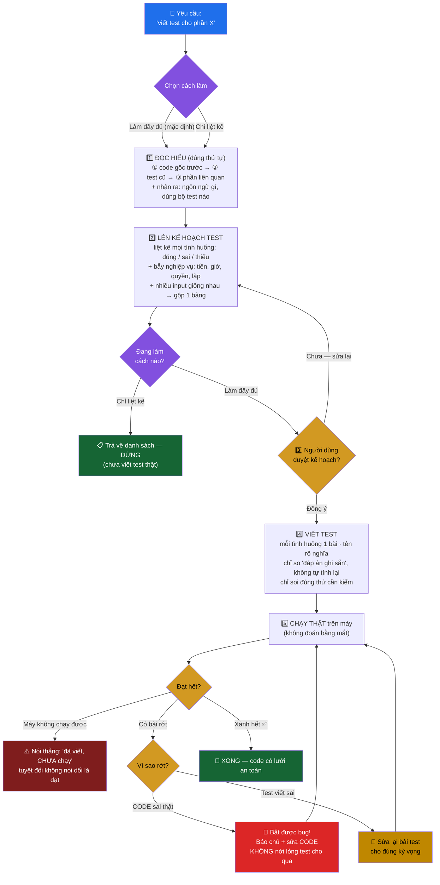

# Luồng xử lý /unit-tests

> Sơ đồ + giải thích từng bước của [`/unit-tests`](../commands/unit-tests/unit-tests.md).
> Mục đích: viết bài kiểm tra tự động (unit test) cho một đoạn code, đúng và đủ.

---

## Vì sao cần bước này

Unit test là **lưới an toàn**: máy tự kiểm code chạy đúng chưa, giống đầu bếp nếm món
trước khi bưng ra. Sau này ai lỡ sửa code làm hỏng, test "kêu" lên ngay — thay vì
để khách (người dùng thật) phát hiện.

Nhưng test viết ẩu còn hại hơn không có: nó tạo cảm giác an toàn giả. Nên luồng dưới
đây bắt buộc **chốt kế hoạch trước khi viết** và **chạy thật trước khi nói xong**.

---

## Sơ đồ luồng

---

## Giải thích từng bước

| Bước | Làm gì | Vì sao |
|---|---|---|
| **1. Đọc hiểu** | Đọc **code gốc trước tiên**, rồi mới xem test cũ, rồi phần liên quan. Nhận diện ngôn ngữ + bộ test đang dùng. | Đọc test/tên trước dễ khiến ta kiểm "cái code *nên* làm" thay vì "cái nó *đang* làm". Xem test cũ để khỏi làm trùng. |
| **2. Lên kế hoạch test** | Liệt kê **có chủ đích** mọi tình huống cần kiểm trước khi viết. Nhiều input cùng kiểu thì gộp một bảng. | Có kế hoạch thì mới đủ, không sót. Đây là "thực đơn nếm" — chốt trước, nếm sau. |
| **3. Duyệt kế hoạch** ✋ | Đưa danh sách cho người dùng duyệt **trước khi** viết code. | Tránh viết cả loạt test sai hướng rồi phải bỏ. Cửa gác quan trọng nhất. |
| **4. Viết test** | Mỗi tình huống một bài, **tên rõ** (đọc tên biết chỗ hỏng), chỉ so với đáp án ghi sẵn, chỉ soi đúng thứ cần. | Một bài một việc → rớt là biết ngay lỗi ở đâu. Tên rõ + assert gọn = sau này dễ đọc, không "kêu oan". |
| **5. Chạy thật** | **Bấm chạy thật**, không đoán. Máy không chạy được thì báo "chưa chạy", không nói dối là đạt. | Bộ test chưa chạy chỉ là "lời hứa", không phải kết quả. |
| **↳ Rớt thì sao?** | Tìm đúng nguyên nhân: **code sai** (bắt được bug → sửa code) hay **test sai** (sửa test). | Rớt không phải luôn là test sai — nhiều khi là test vừa bắt được lỗi thật, rất tốt. |

---

## 3 điều dễ làm sai nhất

1. **Viết một loạt test rồi mới báo** — không chốt kế hoạch với người dùng trước → dễ làm sai hướng, phải bỏ đi làm lại.
2. **Test rớt là nới lỏng cho nó "xanh"** — đó là bịt miệng chuông báo cháy: lỗi vẫn còn nguyên, chỉ là không ai thấy nữa.
3. **Nói "xong" mà chưa chạy thật** — test có thể còn không chạy nổi. Chưa chạy thì phải nói thẳng "đã viết, chưa chạy".

---

## Những "cái bẫy" hay quên (phần đắt giá nhất)

Lỗi mất tiền thật thường nằm ở tình huống đời thường mà người viết code quên, không phải chỗ sai lộ liễu:

| Bẫy | Ví dụ dễ hiểu | Nếu quên test |
|---|---|---|
| 💰 Tiền bạc | Làm tròn — 1000 khách mỗi người lệch 1 xu | Cộng dồn thất thoát tiền |
| 🕐 Thời gian | Server khác múi giờ khách → "hôm nay" lệch 1 ngày | Chốt sổ sai ngày |
| 🔒 Phân quyền | Nhân viên bấm được nút chỉ dành cho sếp | Lộ/sửa dữ liệu trái phép |
| 🔄 Trạng thái | Hoàn tiền đơn khách *chưa trả tiền* | Mất tiền vô lý |
| ⏱️ Chậm / lặp | Mạng lag, bấm "Thanh toán" 2 lần → trừ tiền 2 lần | Khách bị tính tiền đôi |

---

## Kết luận quan trọng

Một bộ unit test tốt là **lưới an toàn tự động**: chốt kế hoạch trước để không sót,
viết gọn để rớt là biết lỗi ở đâu, và **chạy thật** trước khi nói xong. Khi test rớt,
đừng vội sửa test — hỏi "code sai hay test sai?", vì rất có thể nó vừa cứu bạn một bàn thua.

*Bản kỹ thuật cho lập trình viên: [`unit-tests-flow-tech.md`](./unit-tests-flow-tech.md) · Rule đầy đủ: [`unit-tests.md`](../commands/unit-tests/unit-tests.md)*
