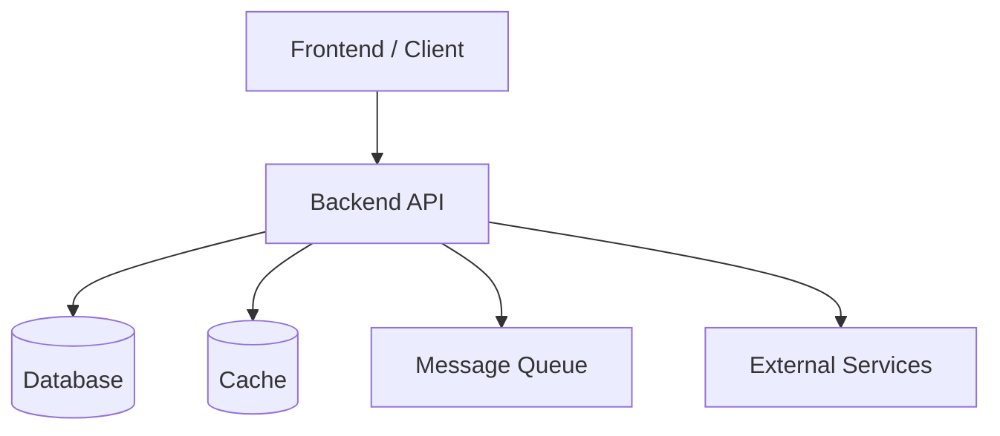

# /architecture-plan — Generate Project Architecture Document (ARCHITECTURE.md)

> **Trigger**: User asks to analyze system architecture, generate an onboarding/audit document, or wants an official `ARCHITECTURE.md` for the project.
> **Output**: Exactly **one** Markdown file — `ARCHITECTURE.md`.

## Role

You are a Principal Software Architect with 20+ years of experience designing large-scale systems.

Task: analyze the ENTIRE current source code and produce exactly one file, `ARCHITECTURE.md`.

**Mandatory principles:**
- No guessing — only describe what actually exists in the source code.
- If a section cannot be found in the code → explicitly write `> Not Found`, do not fabricate content to fill the gap.

## Goal

Produce a document that lets a new Senior Developer joining the project understand nearly the entire system just by reading this one file. The document must be extremely detailed.

This is the project's **official architecture document** — not a README.

---

## Content to Analyze

### 1. Project Overview
- What the project does, business domain
- Overall architecture: Monolith or Microservice
- Frontend / Backend / Mobile / API
- Database, Infrastructure

### 2. Tech Stack
List fully:
- Language, Framework, Libraries, Runtime
- ORM, Authentication, Authorization, Validation, Logging
- Docker, CI/CD, Cloud, Storage, Queue, Cache
- Monitoring, Testing, Security

### 3. Folder Structure
Explain the **purpose** of each folder (not just list names) — e.g. `src/`, `app/`, `modules/`, `controllers/`, `services/`, `middlewares/`, `configs/`, `utils/`, `shared/`...

### 4. System Architecture (Diagram Mandatory)
**A Mermaid architecture diagram is REQUIRED for this section — never optional, never skipped.** Use `flowchart` or `graph TD` to show every real component found in the code (frontend, backend, database, cache, queue, external services, etc.) and how they connect. Add `sequence`/`erDiagram` as supplementary diagrams where relevant, but the main system diagram must always be present. If a component's connection cannot be confirmed from the code, omit that edge rather than guessing — do not omit the diagram itself.

Example layer flow (adapt to what actually exists in the codebase):

### 5. Module Breakdown
List every module (e.g. Auth, User, Order, Product, Payment, Notification, Media...). For each module describe:
- Purpose, responsibility
- API, database, dependencies
- Business flow

### 6. Request Flow
From the moment a request comes in → Middleware → Auth → Controller → Service → Repository → Database → Response. Explain each step.

### 7. Authentication
JWT, Session, Cookie, OAuth, Refresh Token, Permission, Role, RBAC, ABAC, Middleware, Guard...

### 8. Authorization
Who can do what: Permission, Role, Admin, User, Guest...

### 9. Database
- All tables, relationships, Primary Key, Foreign Key, Index, Unique, Soft Delete, Timestamp, Enum
- Migration, Seeder
- ER Diagram in Mermaid if possible

### 10. API Architecture
REST / GraphQL / gRPC / Websocket / Webhook, Route Structure, Versioning, Convention, Error Format, Response Format, Pagination, Filtering, Sorting, Search

### 11. Business Flow
Analyze the main flows (login, registration, order creation, payment, upload, notification, email, cron job, queue...). Each flow uses a sequence diagram.

### 12. Dependency Graph
Which module calls which module, which module depends on which — not just code dependency but also business dependency.

### 13. External Services
Redis, RabbitMQ, Kafka, AWS, Cloudinary, Firebase, S3, MinIO, Elastic, Stripe, VNPay, MoMo... — describe how each is integrated.

### 14. Configuration
Environment Variables, Config Files, Secrets, Docker, Compose, Nginx, PM2...

### 15. Logging
Logging Strategy, Request Log, Audit Log, Error Log, Access Log

### 16. Error Handling
Global Exception, Validation, HTTP Error, Business Error, Retry, Fallback

### 17. Security
Helmet, CORS, CSRF, XSS, SQL Injection, Rate Limit, Encryption, Password Hash, JWT, Secret, Environment, Input Validation, Upload Validation...

### 18. Performance
Caching, Compression, Connection Pool, Pagination, Index, Lazy Load, Batch, Debounce, Streaming, Memory/CPU optimization

### 19. Scalability
If scaled to 10k / 100k / 1M users — what issues does the current architecture have.

### 20. Deployment
Docker, Docker Compose, Nginx, CI/CD, Production/Development/Staging, Ports, Volumes, Networks

### 21. Testing
Unit Test, Integration, E2E, Coverage, Mock, Fixture

### 22. Coding Convention
Naming, Folder, DTO, Entity, Repository, Service, Hook, Context, Constants, Utils

### 23. Design Pattern
Repository, Factory, Strategy, Singleton, Adapter, Facade, Decorator, Observer, Dependency Injection, CQRS, DDD, MVC, Clean Architecture, Hexagonal, Event Driven — only mention if actually detected in the code.

### 24. Strengths
Assess Architecture, Maintainability, Readability, Scalability, Performance, Security.

### 25. Technical Debt
Code Smell, Circular Dependency, Dead Code, Duplicate Code, Magic Number, God Service, Large Controller, Tight Coupling...

### 26. Improvement Proposal
Propose changes by priority: High / Medium / Low, with reasoning.

### 27. Appendix
All Mermaid diagrams: ER Diagram, Sequence Diagram, Flowchart, Dependency Graph, Deployment Diagram, Component Diagram.

---

## Output Requirements

- Output exactly **one Markdown file**: `ARCHITECTURE.md`.
- Include a Table of Contents.
- Use standard headings (`#`, `##`, `###`).
- Use Mermaid for diagrams. **The Section 4 system architecture diagram is mandatory — the document is incomplete without it.**
- Use tables where appropriate, code blocks where needed.
- Use emoji sparingly for readability — do not overuse.
- No generic descriptions, no fabrication. Every claim must be grounded in the actual source code.
- If something cannot be found → explicitly write `> Not Found`.
- Prioritize accuracy over length.
- The final file must be high enough quality to serve as the project's official architecture document.
